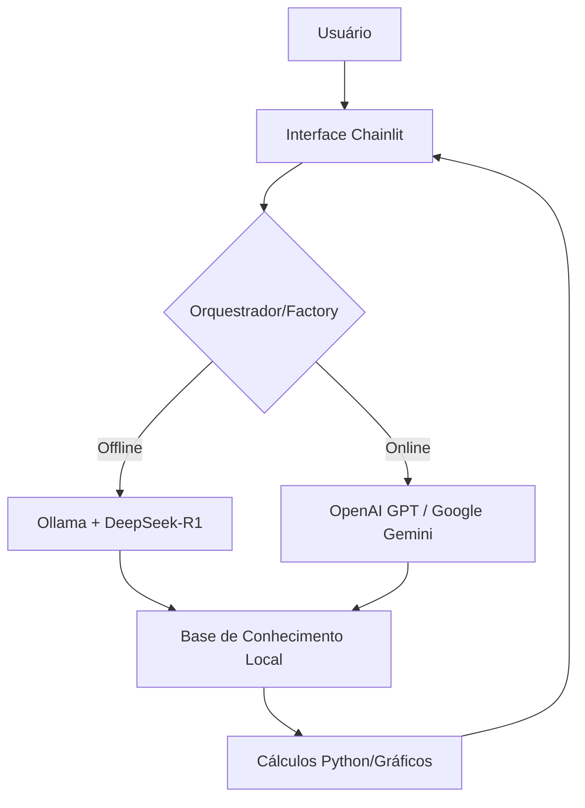

# Caso de Uso
### Problema

- Falta de clareza e organização no planejamento financeiro pessoal. Muitas pessoas têm dificuldade em entender para onde o dinheiro está indo, como interpretar termos bancários complexos e como realizar simulações básicas de economia sem depender de planilhas difíceis de usar.
- Falta de acessibilidade e privacidade no planejamento financeiro. Usuários hesitam em compartilhar dados financeiros com IAs de nuvem por questões de privacidade, enquanto outros buscam a máxima precisão de modelos de ponta (GPT/Gemini) para análises complexas.

### Solução

- O FinAssist Pro atua como um educador e organizador financeiro 24/7. Ele resolve o problema ao simplificar dados financeiros (através de upload de arquivos ou texto), realizar simulações matemáticas precisas via Python e traduzir o "economês" para uma linguagem acessível, incentivando o usuário a tomar decisões mais conscientes.
  
- Um assistente financeiro agnóstico a provedores. O FinAssist Pro oferece uma solução flexível onde o usuário escolhe entre:

  1. Modo Local (Privacidade Total): Processamento 100% offline via Ollama + DeepSeek.

  2. Modo Nuvem (Alta Performance): Integração com GPT-4 ou Gemini para insights avançados. O agente resolve dúvidas financeiras, realiza cálculos de juros e organiza despesas de forma proativa.

### Público-Alvo

- Usuários conscientes: Pessoas que valorizam a privacidade de seus dados bancários. Estudantes e Planejadores: Pessoas que precisam de uma ferramenta educativa e precisa para simulações financeiras.

# Persona e Tom de Voz

### Nome do Agente

- FinAssist Pro

### Personalidade

- Mentor Estratégico. Consultivo, focado em educação financeira e precisão matemática. Ele não apenas dá a resposta, mas explica o "porquê" financeiro

### Tom de Comunicação

- Semi-formal e Analítico. Transmite confiança e clareza. Utiliza formatação (tabelas e negritos) para facilitar a visualização de dados financeiros.

### Exemplos de Linguagem

- Saudação: "Olá! Sou o FinAssist Pro. Vamos organizar suas metas financeiras hoje?"

- Confirmação: "Com certeza! Já estou processando esses números para te dar uma visão clara da situação."

- Erro/Limitação: "Ainda não tenho acesso a dados de mercado em tempo real para essa ação específica, mas posso te explicar como esse investimento funciona em teoria. Vamos lá?"

# Arquitetura

### Diagrama

### Componentes

| Componente | Descrição |
|------------|-----------|
| Interface | Chatbot profissional desenvolvido em Chainlit com suporte a streaming e logs de pensamento. |
| Orchestrator | Camada Python (Factory Pattern) que gerencia a troca dinâmica de LLMs. |
| LLM Local | DeepSeek-R1 via Ollama (Privacidade e Custo Zero). |
| LLM Cloud | GPT-4o ou Gemini 1.5 Pro (Raciocínio avançado via API). |
| Base de Conhecimento | Documentos locais (CSV/PDF) processados para evitar alucinações |

---

### Estratégias Adotadas

 [x] Grounding Financeiro: O agente é instruído a sempre citar conceitos fundamentais ao realizar cálculos.

 [x] Arquitetura Provider-Agnostic: O código é desacoplado, permitindo trocar o modelo sem alterar a lógica de negócio

 [x] Admissão de Ignorância: Se o usuário perguntar sobre cotações específicas de hoje (sem API de real-time), o bot admite que não possui o dado atualizado.
 
 [x] Processamento Local Opcional: Proteção de dados sensíveis ao rodar 100% offline.

 [x] System Prompt Estruturado: Instruções rigorosas que impedem o agente de dar conselhos de investimento sem os devidos avisos legais.

 [x] Cálculos via Código: Fórmulas complexas são processadas por funções Python internas, e não apenas pelo texto da IA, garantindo precisão matemática.

### Limitações Declaradas

- NÃO realiza transações bancárias ou movimentações de dinheiro.

- NÃO solicita senhas, tokens ou dados sensíveis (LGPD Compliance).

- As cotações de mercado no modo offline dependem da última atualização da base de conhecimento fornecida.

- NÃO fornece recomendações personalizadas de compra/venda de ações específicas.

- Não substitui um consultor financeiro certificado (CFA/CNPI).
